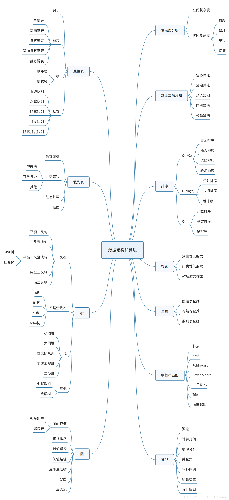

# 数据结构 经典算法

# leetcode

包括了leetcode刷题结果。

# 数据结构

## 写在前面：

数据结构是计算机的基础课。其底层存储只有2种类型，顺序存储和链式存储。

因此，我这里实现的数据结构，没有用到第三方包的实现，完全利用最原始的方法来实现常用的数据结构，以及基于其上的一些算法。

虽然整个项目是用python实现的，但中间未使用”奇技淫巧“，只要方法正确，可以很快速地扩展到其他语言。

## 缺失之处：

参数校验：这是一个非常麻烦的工作，用户可能输入的情况千奇百怪，因此参数校验只做了最基础的部分。

可扩展性：每个文件内都有各自类的测试。并没有去实现一个模板支持各种情况。例如：堆中实现的是大根堆。若构造时传入比较函数，则可扩展为小根堆。

## 目录

* [单链表](/DataStructure/LinkedList/SingleLinkedList.py)

  * 从传入的列表中构造单链表
  * 头插一个元素
  * 尾插一个元素
  * 向中间指定位置插入元素
  * 删除头部元素
  * 删除尾部元素
  * 删除指定中间位置的元素
  * 查找某个元素是否存在
  * 递归反转整个链表

* [双向链表](/DataStructure/LinkedList/DeLinkedList.py)

  * 从传入的列表中构造单链表
  * 头插一个元素
  * 尾插一个元素
  * 向中间指定位置插入元素
  * 删除头部元素
  * 删除尾部元素
  * 删除指定中间位置的元素
  * 查找某个元素是否存在

* [二叉树](/DataStructure/Tree/BinaryTree.py)

  * 从先序列表和中序列表构造二叉树
  * 二叉树的先序递归遍历
  * 二叉树的中序递归遍历
  * 二叉树的后序递归遍历
  * 二叉树的先序非递归遍历
  * 二叉树的中序非递归遍历
  * 二叉树的后序非递归遍历
  * 二叉树的层序遍历

* [字典树](/DataStructure/Tree/TrieTree.py)

  * 通过strings_list构造一颗字典树
  * 增加一个串
  * 查找字典树中是否存在对应串
  * 查找与prefix具有相同前缀的串
  * 删除字典树中的串
  * 获取字典树中的串的数量
  * 清空所有元素
  * 遍历以node为结点的整个字典树

* [最小栈](/DataStructure/Stack/MinStack.py)

  * 从传入的列表中构造最小栈
  * 插入一个元素
  * 弹出一个元素
  * 取得最小元素
  * 清空所有元素

* [堆](/DataStructure/Heap/Heap.py)

  * 通过数组构造一个堆
  * 向堆中插入一个元素
  * 取出堆顶元素
  * 判断堆是否是空的
  * 清空所有元素
  * 将数组变成一个堆
  * 堆中index结点上浮
  * 堆中index结点下沉

# 经典算法

## 目录

### 排序算法

* [冒泡排序](/Algorighms/Sort/BubbleSort.py)
* [选择排序](/Algorighms/Sort/SelectionSort.py)
* [插入排序](/Algorighms/Sort/InsertSort.py)
* [快速排序](/Algorighms/Sort/QuickSort.py)

### 搜索算法

* [二分查找](/Algorighms/Search/BinarySearch.py)
* [二分查找左右边界](/Algorighms/Search/BinarySearch.py)

## 数据结构思维导图

